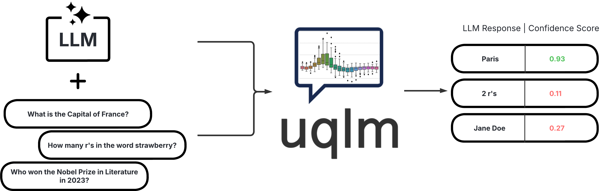
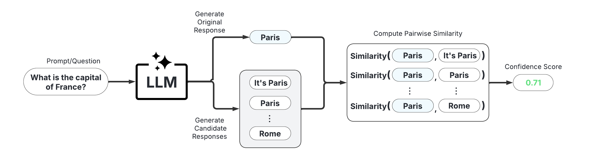
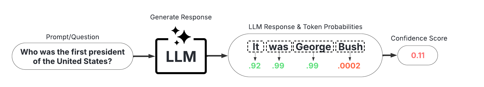
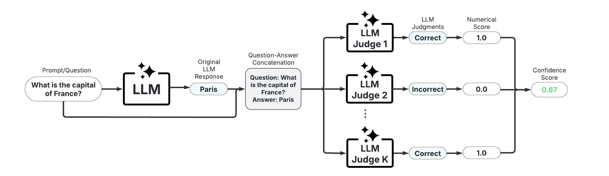
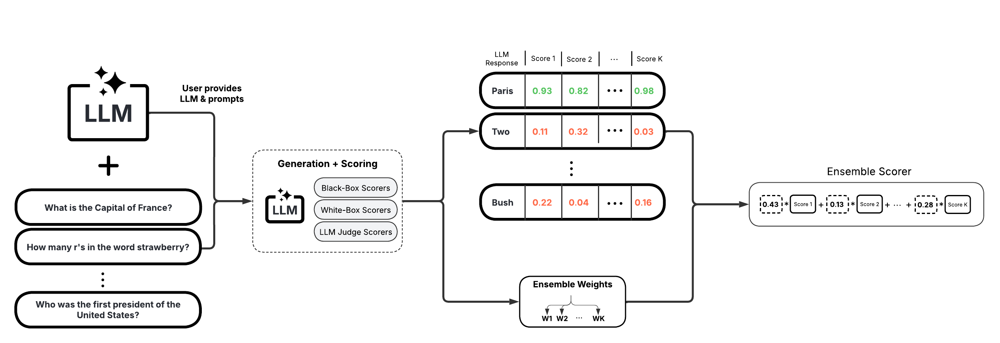

<<<<<<< HEAD
<p align="center">
  <picture>
    <source media="(prefers-color-scheme: dark)" srcset="assets/images/uqlm_flow_ds_dark.png">
    <source media="(prefers-color-scheme: light)" srcset="assets/images/uqlm_flow_ds.png">
    
  </picture>
</p>


# uqlm: Uncertainty Quantification for Language Models

[](https://github.com/cvs-health/uqlm/actions)
[](https://pypi.org/project/uqlm/)
[](https://cvs-health.github.io/uqlm/latest/index.html)
[](https://github.com/astral-sh/ruff)
[](https://arxiv.org/abs/2504.19254)

UQLM is a Python library for Large Language Model (LLM) hallucination detection using state-of-the-art uncertainty quantification techniques. 

## Installation
The latest version can be installed from PyPI:

```bash
pip install uqlm
```

## Hallucination Detection
UQLM provides a suite of response-level scorers for quantifying the uncertainty of Large Language Model (LLM) outputs. Each scorer returns a confidence score between 0 and 1, where higher scores indicate a lower likelihood of errors or hallucinations.  We categorize these scorers into four main types:


| Scorer Type            | Added Latency                                      | Added Cost                               | Compatibility                                             | Off-the-Shelf / Effort                                  |
|------------------------|----------------------------------------------------|------------------------------------------|-----------------------------------------------------------|---------------------------------------------------------|
| [Black-Box Scorers](#black-box-scorers-consistency-based)      | ⏱️ Medium-High (multiple generations & comparisons)           | 💸 High (multiple LLM calls)             | 🌍 Universal (works with any LLM)                         | ✅ Off-the-shelf |
| [White-Box Scorers](#white-box-scorers-token-probability-based)      | ⚡ Minimal (token probabilities already returned)   | ✔️ None (no extra LLM calls)             | 🔒 Limited (requires access to token probabilities)       | ✅ Off-the-shelf            |
| [LLM-as-a-Judge Scorers](#llm-as-a-judge-scorers) | ⏳ Low-Medium (additional judge calls add latency)    | 💵 Low-High (depends on number of judges)| 🌍 Universal (any LLM can serve as judge)                     |✅  Off-the-shelf        |
| [Ensemble Scorers](#ensemble-scorers)       | 🔀 Flexible (combines various scorers)       | 🔀 Flexible (combines various scorers)      | 🔀 Flexible (combines various scorers)                    | ✅  Off-the-shelf (beginner-friendly); 🛠️ Can be tuned (best for advanced users)    |


Below we provide illustrative code snippets and details about available scorers for each type.

### Black-Box Scorers (Consistency-Based)

These scorers assess uncertainty by measuring the consistency of multiple responses generated from the same prompt. They are compatible with any LLM, intuitive to use, and don't require access to internal model states or token probabilities.

<p align="center">
  <picture>
    <source media="(prefers-color-scheme: dark)" srcset="assets/images/black_box_graphic_dark.png">
    <source media="(prefers-color-scheme: light)" srcset="assets/images/black_box_graphic.png">
    
  </picture>
</p>

**Example Usage:**
Below is a sample of code illustrating how to use the `BlackBoxUQ` class to conduct hallucination detection.

```python
from langchain_google_vertexai import ChatVertexAI
llm = ChatVertexAI(model='gemini-pro')

from uqlm import BlackBoxUQ
bbuq = BlackBoxUQ(llm=llm, scorers=["semantic_negentropy"], use_best=True)

results = await bbuq.generate_and_score(prompts=prompts, num_responses=5)
results.to_df()
```
<p align="center">
  
</p>

Above, `use_best=True` implements mitigation so that the uncertainty-minimized responses is selected. Note that although we use `ChatVertexAI` in this example, any [LangChain Chat Model](https://js.langchain.com/docs/integrations/chat/) may be used. For a more detailed demo, refer to our [Black-Box UQ Demo](./examples/black_box_demo.ipynb).


**Available Scorers:**

*   Non-Contradiction Probability ([Chen & Mueller, 2023](https://arxiv.org/abs/2308.16175); [Lin et al., 2024](https://arxiv.org/abs/2305.19187); [Manakul et al., 2023](https://arxiv.org/abs/2303.08896))
*   Discrete Semantic Entropy ([Farquhar et al., 2024](https://www.nature.com/articles/s41586-024-07421-0); [Bouchard & Chauhan, 2025](https://arxiv.org/abs/2504.19254))
*   Exact Match ([Cole et al., 2023](https://arxiv.org/abs/2305.14613); [Chen & Mueller, 2023](https://arxiv.org/abs/2308.16175))
*   BERT-score ([Manakul et al., 2023](https://arxiv.org/abs/2303.08896); [Zheng et al., 2020](https://arxiv.org/abs/1904.09675))
*   Cosine Similarity ([Shorinwa et al., 2024](https://arxiv.org/abs/2412.05563); [HuggingFace](https://huggingface.co/sentence-transformers/all-MiniLM-L6-v2))
*   BLUERT ([Sellam et al., 2020](https://arxiv.org/abs/2004.04696); Deprecated as of `v0.2.0`)

### White-Box Scorers (Token-Probability-Based)

These scorers leverage token probabilities to estimate uncertainty.  They are significantly faster and cheaper than black-box methods, but require access to the LLM's internal probabilities, meaning they are not necessarily compatible with all LLMs/APIs.

<p align="center">
  <picture>
    <source media="(prefers-color-scheme: dark)" srcset="assets/images/white_box_graphic_dark.png">
    <source media="(prefers-color-scheme: light)" srcset="assets/images/white_box_graphic.png">
    
  </picture>
</p>

**Example Usage:**
Below is a sample of code illustrating how to use the `WhiteBoxUQ` class to conduct hallucination detection. 

```python
from langchain_google_vertexai import ChatVertexAI
llm = ChatVertexAI(model='gemini-pro')

from uqlm import WhiteBoxUQ
wbuq = WhiteBoxUQ(llm=llm, scorers=["min_probability"])

results = await wbuq.generate_and_score(prompts=prompts)
results.to_df()
```
<p align="center">
  
</p>

Again, any [LangChain Chat Model](https://js.langchain.com/docs/integrations/chat/) may be used in place of `ChatVertexAI`. For a more detailed demo, refer to our [White-Box UQ Demo](./examples/white_box_demo.ipynb).


**Available Scorers:**

*   Minimum token probability ([Manakul et al., 2023](https://arxiv.org/abs/2303.08896))
*   Length-Normalized Joint Token Probability ([Malinin & Gales, 2021](https://arxiv.org/abs/2002.07650))

### LLM-as-a-Judge Scorers

These scorers use one or more LLMs to evaluate the reliability of the original LLM's response.  They offer high customizability through prompt engineering and the choice of judge LLM(s).

<p align="center">
  <picture>
    <source media="(prefers-color-scheme: dark)" srcset="assets/images/judges_graphic_dark.png">
    <source media="(prefers-color-scheme: light)" srcset="assets/images/judges_graphic.png">
    
  </picture>
</p>

**Example Usage:**
Below is a sample of code illustrating how to use the `LLMPanel` class to conduct hallucination detection using a panel of LLM judges. 

```python
from langchain_google_vertexai import ChatVertexAI
llm1 = ChatVertexAI(model='gemini-1.0-pro')
llm2 = ChatVertexAI(model='gemini-1.5-flash-001')
llm3 = ChatVertexAI(model='gemini-1.5-pro-001')

from uqlm import LLMPanel
panel = LLMPanel(llm=llm1, judges=[llm1, llm2, llm3])

results = await panel.generate_and_score(prompts=prompts)
results.to_df()
```
<p align="center">
  
</p>

Note that although we use `ChatVertexAI` in this example, we can use any [LangChain Chat Model](https://js.langchain.com/docs/integrations/chat/) as judges. For a more detailed demo illustrating how to customize a panel of LLM judges, refer to our [LLM-as-a-Judge Demo](./examples/judges_demo.ipynb).


**Available Scorers:**

*   Categorical LLM-as-a-Judge ([Manakul et al., 2023](https://arxiv.org/abs/2303.08896); [Chen & Mueller, 2023](https://arxiv.org/abs/2308.16175); [Luo et al., 2023](https://arxiv.org/abs/2303.15621))
*   Continuous LLM-as-a-Judge ([Xiong et al., 2024](https://arxiv.org/abs/2306.13063))
*   Panel of LLM Judges ([Verga et al., 2024](https://arxiv.org/abs/2404.18796))
*   Likert Scale Scoring ([Bai et al., 2023](https://arxiv.org/pdf/2306.04181))

### Ensemble Scorers

These scorers leverage a weighted average of multiple individual scorers to provide a more robust uncertainty/confidence estimate. They offer high flexibility and customizability, allowing you to tailor the ensemble to specific use cases.

<p align="center">
  <picture>
    <source media="(prefers-color-scheme: dark)" srcset="assets/images/uqensemble_generate_score_dark.png">
    <source media="(prefers-color-scheme: light)" srcset="assets/images/uqensemble_generate_score.png">
    
  </picture>
</p>

**Example Usage:**
Below is a sample of code illustrating how to use the `UQEnsemble` class to conduct hallucination detection. 

```python
from langchain_google_vertexai import ChatVertexAI
llm = ChatVertexAI(model='gemini-pro')

from uqlm import UQEnsemble
## ---Option 1: Off-the-Shelf Ensemble---
# uqe = UQEnsemble(llm=llm)
# results = await uqe.generate_and_score(prompts=prompts, num_responses=5)

## ---Option 2: Tuned Ensemble---
scorers = [ # specify which scorers to include
    "exact_match", "noncontradiction", # black-box scorers
    "min_probability", # white-box scorer
    llm # use same LLM as a judge
]
uqe = UQEnsemble(llm=llm, scorers=scorers)

# Tune on tuning prompts with provided ground truth answers
tune_results = await uqe.tune(
    prompts=tuning_prompts, ground_truth_answers=ground_truth_answers
)
# ensemble is now tuned - generate responses on new prompts
results = await uqe.generate_and_score(prompts=prompts)
results.to_df()
```
<p align="center">
  
</p>

As with the other examples, any [LangChain Chat Model](https://js.langchain.com/docs/integrations/chat/) may be used in place of `ChatVertexAI`. For more detailed demos, refer to our [Off-the-Shelf Ensemble Demo](./examples/ensemble_off_the_shelf_demo.ipynb) (quick start) or our [Ensemble Tuning Demo](./examples/ensemble_tuning_demo.ipynb) (advanced).


**Available Scorers:**

*   BS Detector ([Chen & Mueller, 2023](https://arxiv.org/abs/2308.16175))
*   Generalized UQ Ensemble ([Bouchard & Chauhan, 2025](https://arxiv.org/abs/2504.19254))

## Documentation
Check out our [documentation site](https://cvs-health.github.io/uqlm/latest/index.html) for detailed instructions on using this package, including API reference and more.

## Example notebooks
Explore the following demo notebooks to see how to use UQLM for various hallucination detection methods:

- [Black-Box Uncertainty Quantification](https://github.com/cvs-health/uqlm/blob/main/examples/black_box_demo.ipynb): A notebook demonstrating hallucination detection with black-box (consistency) scorers.
- [White-Box Uncertainty Quantification](https://github.com/cvs-health/uqlm/blob/main/examples/white_box_demo.ipynb): A notebook demonstrating hallucination detection with white-box (token probability-based) scorers.
- [LLM-as-a-Judge](https://github.com/cvs-health/uqlm/blob/main/examples/judges_demo.ipynb): A notebook demonstrating hallucination detection with LLM-as-a-Judge.
- [Tunable UQ Ensemble](https://github.com/cvs-health/uqlm/blob/main/examples/ensemble_tuning_demo.ipynb): A notebook demonstrating hallucination detection with a tunable ensemble of UQ scorers ([Bouchard & Chauhan, 2025](https://arxiv.org/abs/2504.19254)).
- [Off-the-Shelf UQ Ensemble](https://github.com/cvs-health/uqlm/blob/main/examples/ensemble_off_the_shelf_demo.ipynb): A notebook demonstrating hallucination detection using BS Detector ([Chen & Mueller, 2023](https://arxiv.org/abs/2308.16175)) off-the-shelf ensemble.
- [Semantic Entropy](https://github.com/cvs-health/uqlm/blob/main/examples/semantic_entropy_demo.ipynb): A notebook demonstrating token-probability-based semantic entropy ([Farquhar et al., 2024](https://www.nature.com/articles/s41586-024-07421-0); [Kuhn et al., 2023](https://arxiv.org/abs/2302.09664)), which combines elements of black-box UQ and white-box UQ to compute confidence scores.
- [Multimodal Uncertainty Quantification](https://github.com/cvs-health/uqlm/blob/main/examples/multimodal_demo.ipynb): A notebook demonstrating UQLM's scoring approach with multimodal inputs (compatible with black-box UQ and white-box UQ).
- [Score Calibration](https://github.com/cvs-health/uqlm/blob/main/examples/score_calibration_demo.ipynb): A notebook illustrating transformation of confidence scores into calibrated probabilities that better reflect the true likelihood of correctness.

## Associated Research
A technical description of the `uqlm` scorers and extensive experiment results are contained in this **[this paper](https://arxiv.org/abs/2504.19254)**. If you use our framework or toolkit, we would appreciate citations to the following paper:

```bibtex
@misc{bouchard2025uncertaintyquantificationlanguagemodels,
      title={Uncertainty Quantification for Language Models: A Suite of Black-Box, White-Box, LLM Judge, and Ensemble Scorers}, 
      author={Dylan Bouchard and Mohit Singh Chauhan},
      year={2025},
      eprint={2504.19254},
      archivePrefix={arXiv},
      primaryClass={cs.CL},
      url={https://arxiv.org/abs/2504.19254}, 
}
```
=======
# Uncertainty Quantification and Hallucination Detection in Large Language Models


## Getting started

To make it easy for you to get started with GitLab, here's a list of recommended next steps.

Already a pro? Just edit this README.md and make it your own. Want to make it easy? [Use the template at the bottom](#editing-this-readme)!

## Add your files

- [ ] [Create](https://docs.gitlab.com/ee/user/project/repository/web_editor.html#create-a-file) or [upload](https://docs.gitlab.com/ee/user/project/repository/web_editor.html#upload-a-file) files
- [ ] [Add files using the command line](https://docs.gitlab.com/topics/git/add_files/#add-files-to-a-git-repository) or push an existing Git repository with the following command:

```
cd existing_repo
git remote add origin https://git.uni-regensburg.de/mluq_courses/abschlussarbeiten/wintersemester_2025/uncertainty-quantification-and-hallucination-detection-in-large-language-models.git
git branch -M main
git push -uf origin main
```

## Integrate with your tools

- [ ] [Set up project integrations](https://git.uni-regensburg.de/mluq_courses/abschlussarbeiten/wintersemester_2025/uncertainty-quantification-and-hallucination-detection-in-large-language-models/-/settings/integrations)

## Collaborate with your team

- [ ] [Invite team members and collaborators](https://docs.gitlab.com/ee/user/project/members/)
- [ ] [Create a new merge request](https://docs.gitlab.com/ee/user/project/merge_requests/creating_merge_requests.html)
- [ ] [Automatically close issues from merge requests](https://docs.gitlab.com/ee/user/project/issues/managing_issues.html#closing-issues-automatically)
- [ ] [Enable merge request approvals](https://docs.gitlab.com/ee/user/project/merge_requests/approvals/)
- [ ] [Set auto-merge](https://docs.gitlab.com/user/project/merge_requests/auto_merge/)

## Test and Deploy

Use the built-in continuous integration in GitLab.

- [ ] [Get started with GitLab CI/CD](https://docs.gitlab.com/ee/ci/quick_start/)
- [ ] [Analyze your code for known vulnerabilities with Static Application Security Testing (SAST)](https://docs.gitlab.com/ee/user/application_security/sast/)
- [ ] [Deploy to Kubernetes, Amazon EC2, or Amazon ECS using Auto Deploy](https://docs.gitlab.com/ee/topics/autodevops/requirements.html)
- [ ] [Use pull-based deployments for improved Kubernetes management](https://docs.gitlab.com/ee/user/clusters/agent/)
- [ ] [Set up protected environments](https://docs.gitlab.com/ee/ci/environments/protected_environments.html)

***

# Editing this README

When you're ready to make this README your own, just edit this file and use the handy template below (or feel free to structure it however you want - this is just a starting point!). Thanks to [makeareadme.com](https://www.makeareadme.com/) for this template.

## Suggestions for a good README

Every project is different, so consider which of these sections apply to yours. The sections used in the template are suggestions for most open source projects. Also keep in mind that while a README can be too long and detailed, too long is better than too short. If you think your README is too long, consider utilizing another form of documentation rather than cutting out information.

## Name
Choose a self-explaining name for your project.

## Description
Let people know what your project can do specifically. Provide context and add a link to any reference visitors might be unfamiliar with. A list of Features or a Background subsection can also be added here. If there are alternatives to your project, this is a good place to list differentiating factors.

## Badges
On some READMEs, you may see small images that convey metadata, such as whether or not all the tests are passing for the project. You can use Shields to add some to your README. Many services also have instructions for adding a badge.

## Visuals
Depending on what you are making, it can be a good idea to include screenshots or even a video (you'll frequently see GIFs rather than actual videos). Tools like ttygif can help, but check out Asciinema for a more sophisticated method.

## Installation
Within a particular ecosystem, there may be a common way of installing things, such as using Yarn, NuGet, or Homebrew. However, consider the possibility that whoever is reading your README is a novice and would like more guidance. Listing specific steps helps remove ambiguity and gets people to using your project as quickly as possible. If it only runs in a specific context like a particular programming language version or operating system or has dependencies that have to be installed manually, also add a Requirements subsection.

## Usage
Use examples liberally, and show the expected output if you can. It's helpful to have inline the smallest example of usage that you can demonstrate, while providing links to more sophisticated examples if they are too long to reasonably include in the README.

## Support
Tell people where they can go to for help. It can be any combination of an issue tracker, a chat room, an email address, etc.

## Roadmap
If you have ideas for releases in the future, it is a good idea to list them in the README.

## Contributing
State if you are open to contributions and what your requirements are for accepting them.

For people who want to make changes to your project, it's helpful to have some documentation on how to get started. Perhaps there is a script that they should run or some environment variables that they need to set. Make these steps explicit. These instructions could also be useful to your future self.

You can also document commands to lint the code or run tests. These steps help to ensure high code quality and reduce the likelihood that the changes inadvertently break something. Having instructions for running tests is especially helpful if it requires external setup, such as starting a Selenium server for testing in a browser.

## Authors and acknowledgment
Show your appreciation to those who have contributed to the project.

## License
For open source projects, say how it is licensed.

## Project status
If you have run out of energy or time for your project, put a note at the top of the README saying that development has slowed down or stopped completely. Someone may choose to fork your project or volunteer to step in as a maintainer or owner, allowing your project to keep going. You can also make an explicit request for maintainers.
>>>>>>> github/main
